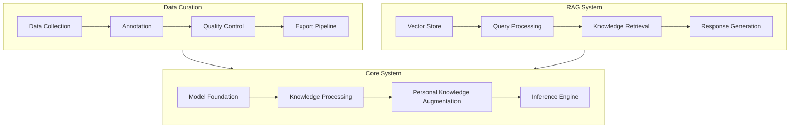
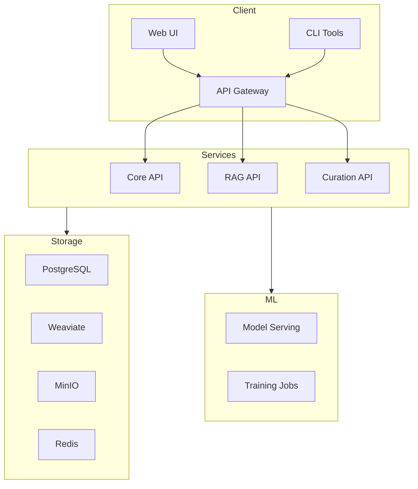

# Architecture Overview

## System Architecture

The Semblance AI architecture is built on three main pillars: Core System, Data Curation, and RAG System. These components work together to provide a comprehensive personal AI experience.



## Component Breakdown

### Core System

#### Model Foundation
- **Base Models**: Hugging Face Transformers integration
- **Training Infrastructure**: PyTorch + Distributed Training
- **Model Registry**: MLflow tracking
- **Versioning**: DVC for model versioning

#### Knowledge Processing
- **Text Processing**: spaCy + transformers
- **Semantic Analysis**: sentence-transformers
- **Knowledge Graphs**: Neo4j integration
- **Entity Recognition**: Prodigy + custom NER

#### Personal Knowledge Augmentation
- **Dataset Management**: DVC + Git LFS
- **Training Pipeline**: PyTorch Lightning
- **Evaluation Metrics**: Custom metrics suite
- **Validation Tools**: WandB integration

#### Inference Engine
- **Serving Layer**: TorchServe
- **Memory System**: Redis + PostgreSQL
- **Context Management**: Custom context handlers
- **Output Validation**: Safety checkers

### Data Curation

#### Data Collection
- **Input Formats**: PDF, EPUB, HTML, Markdown
- **Conversion Tools**: Pandoc integration
- **Metadata Extraction**: Apache Tika
- **Storage**: MinIO + PostgreSQL

#### Annotation
- **Tools**: Label Studio + Argilla
- **Templates**: Custom annotation schemas
- **Quality Metrics**: Inter-annotator agreement
- **Review System**: Built-in validation

#### Quality Control
- **Validation Rules**: JSON Schema
- **Duplicate Detection**: LSH + MinHash
- **Error Detection**: Custom validators
- **Correction Tools**: Web-based interface

### RAG System

#### Vector Store
- **Engine**: Weaviate
- **Embeddings**: text2vec-transformers
- **Indexing**: HNSW algorithm
- **Storage**: Persistent vectors

#### Query Processing
- **Understanding**: T5 query expansion
- **Context**: Sliding window approach
- **Relevance**: BM25 + semantic search
- **Routing**: Custom query router

## Technical Stack

### Backend Services
- **API Gateway**: Traefik
- **Core API**: FastAPI
- **Web Backend**: Laravel 10
- **Task Queue**: Celery + Redis
- **Caching**: Redis Cluster

### Data Storage
- **Document Store**: PostgreSQL 15
- **Vector Store**: Weaviate
- **Object Storage**: MinIO
- **Cache**: Redis
- **Logs**: Elasticsearch

### ML Infrastructure
- **Training**: PyTorch + Lightning
- **Serving**: TorchServe
- **Experiment Tracking**: MLflow
- **Model Registry**: DVC

### Monitoring
- **Metrics**: Prometheus
- **Logging**: ELK Stack
- **Tracing**: Jaeger
- **Dashboards**: Grafana

## Deployment Architecture



## Security Architecture

### Authentication
- JWT-based authentication
- OAuth2 support
- Role-based access control
- API key management

### Data Protection
- End-to-end encryption
- Data isolation
- Secure storage
- Access auditing

### Network Security
- TLS everywhere
- API gateway
- Rate limiting
- DDoS protection

## Development Setup

For local development:

```bash
# Clone repositories
git clone https://github.com/eooo-io/semblance-ai.git
cd semblance-ai

# Start core services
docker compose up -d

# Start development environment
make dev
```

For detailed setup instructions, see the [local setup guide](/development/local-setup).

## Next Steps

- [installation guide](/getting-started/installation)
- [configuration guide](/getting-started/configuration)
- [API Reference](../reference/api.md)
- [contributing guidelines](/development/contributing) 