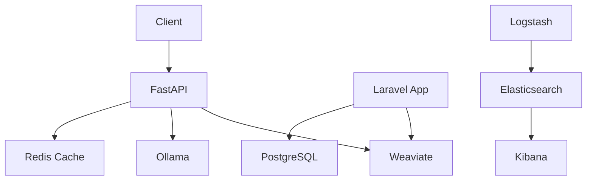

# RAG System

The Retrieval-Augmented Generation (RAG) system provides intelligent document processing and question answering capabilities.

## Services

The system includes several services that work together:

- **Web Interface**: Available at `http://localhost:3000` in development
- **API Server**: Available at `http://localhost:8000` in development
- **Kibana**: Available at `http://localhost:5601` in development
- **Vector Store**: Available at `http://localhost:9000` in development

## Documentation

- [Deployment Guide](/rag/deployment)
- [API Reference](/rag/api-reference)
- [Architecture Overview](/rag/architecture)
- [Configuration Guide](/rag/configuration)

## Development

For development setup and contribution guidelines, see:

- [Local Development Setup](/development/local-setup)
- [Contributing Guidelines](/development/contributing)
- [Testing Guide](/development/testing)

Semblance RAG is a modular Retrieval-Augmented Generation (RAG) platform designed to support knowledge indexing, semantic search, and language model augmentation workflows. It leverages containerized microservices to ensure a flexible and extensible architecture for AI-enabled applications.

## Tech Stack

Our RAG system is built with modern, production-ready technologies:

- **Docker & Docker Compose** - Container orchestration
- **Python & FastAPI** - Core API services
- **Laravel PHP** - Web application backend
- **PostgreSQL** - Primary database
- **Redis** - Caching layer
- **MinIO** - Object storage
- **Elasticsearch** - Log and document indexing
- **Weaviate** - Vector search engine
- **Ollama** - Local model hosting
- **OpenWebUI** - Web interface

## Core Components

### API Service (FastAPI)
- REST endpoints for query handling
- Health monitoring
- Integration with Weaviate and language models
- Scalable request processing

### Web Application (Laravel)
- Business logic implementation
- Orchestration routines
- Administrative interface
- Platform integration capabilities

### Vector Search (Weaviate)
- Semantic retrieval engine
- text2vec-openai module integration
- Efficient vector storage and search
- Real-time indexing capabilities

### Model Hosting (Ollama)
- Local model deployment
- GPU acceleration support
- Custom model management
- Efficient inference pipeline

### Monitoring Stack
- **Logstash**: Log ingestion and routing
- **Elasticsearch**: Structured data storage
- **Kibana**: Monitoring dashboard
- **OpenWebUI**: Model interaction interface

## Service Access

| Service       | URL                         | Purpose                    |
|---------------|-----------------------------|----------------------------|
| FastAPI Docs  | http://localhost:8000/docs  | API Documentation         |
| Laravel App   | http://localhost:9000       | Web Interface             |
| Kibana        | http://localhost:5601       | Monitoring Dashboard      |
| OpenWebUI     | http://localhost:3000       | Model Interaction         |

## Example Usage

### Query Endpoint

```json
POST /query
{
  "query": "What is Semblance?",
  "top_k": 5
}
```

The response includes:
- Top-ranked document chunks
- Relevance scores
- Source metadata
- Generated responses

## Upcoming Features

- Enhanced GPU support for local model inference
- Semantic chunking pipeline
- Document management system
- Role-based access control
- Cloud-native deployment options
- Horizontal scaling capabilities

## Architecture Diagram



For detailed setup instructions and configuration options, see the [Deployment Guide](./deployment.md) and [API Reference](./api-reference.md). 